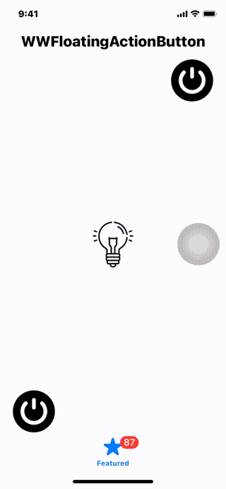

# WWFloatingActionButton

[](https://developer.apple.com/swift/) [](https://developer.apple.com/swift/) [](https://developer.apple.com/swift/) [](https://developer.apple.com/swift/)

Android-like FloatingActionButton. / 仿Android的FloatingActionButton.



### [Installation with Swift Package Manager](https://medium.com/彼得潘的-swift-ios-app-開發問題解答集/使用-spm-安裝第三方套件-xcode-11-新功能-2c4ffcf85b4b)
```bash
dependencies: [
    .package(url: "https://github.com/William-Weng/WWFloatingActionButton.git", .upToNextMajor(from: "1.1.1"))
]
```


### Example
```swift
import UIKit
import WWFloatingActionButton

final class ViewController: UIViewController {

    @IBOutlet weak var myFloatingActionButton: WWFloatingActionButton!
    @IBOutlet weak var myImageView: UIImageView!
    @IBOutlet weak var titleLabel: UILabel!
    
    override func viewDidLoad() {
        super.viewDidLoad()
        self.title = "WWFloatingActionButton"
        myFloatingActionButton.myDelegate = self
        myFloatingActionButton.backgroundColor = .clear
    }
}

// MARK: - WWFloatButtonDelegate
extension ViewController: WWFloatingActionButtonDelegate {
    
    func currentViewType(with tag: Int) -> WWFloatingButtonAnimationViewType {
        return .tabBarController(self)
    }
    
    func itemButtonAnimationType(with tag: Int) -> WWFloatingButtonAnimationType {
        return .circleArc(startAngle: 90, endAngle: 180, distance: 200, count: 5)
    }

    func itemButtonImages(with tag: Int) -> [UIImage] {
        let images = [#imageLiteral(resourceName: "plus"), #imageLiteral(resourceName: "power"), #imageLiteral(resourceName: "refresh"), #imageLiteral(resourceName: "play"), #imageLiteral(resourceName: "chart")]
        return images
    }
    
    func itemButton(with tag: Int, didTouched index: Int) {
        let images = [#imageLiteral(resourceName: "desktop_1"), #imageLiteral(resourceName: "desktop_2"), #imageLiteral(resourceName: "desktop_5"), #imageLiteral(resourceName: "desktop_3"), #imageLiteral(resourceName: "desktop_4")]
        myImageView.image = images[index]
    }
    
    func mainButtonStatus(isTouched: Bool, with tag: Int) {
        titleLabel.text = isTouched ? "Touched" : "Closed"
    }
}
```

### 版本更新說明
|版本號|說明|備註|
|-|-|-|
|1.1.1|修改currentViewType(with tag: Int)|-|
|1.1.0|新增圓弧動畫效果|-|
|1.0.0|基本上下左右四個方向的動畫|-|
